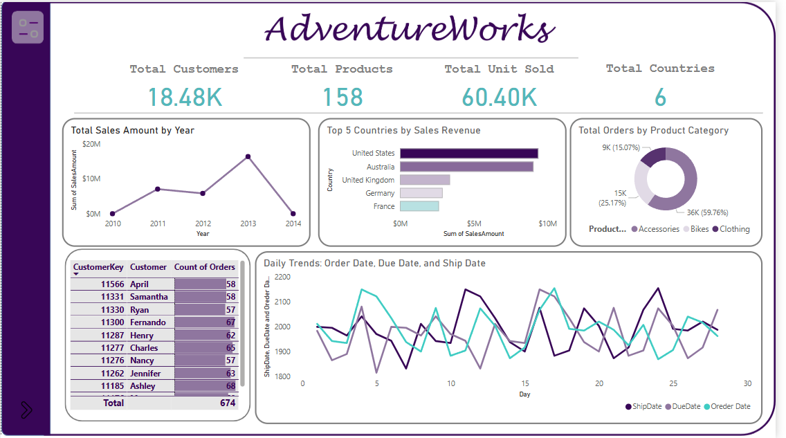
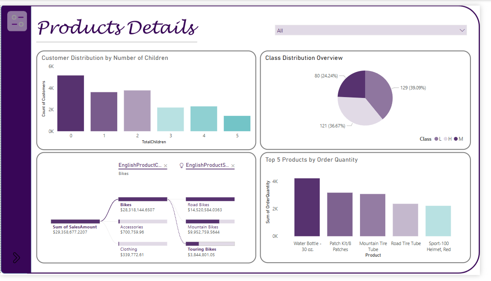
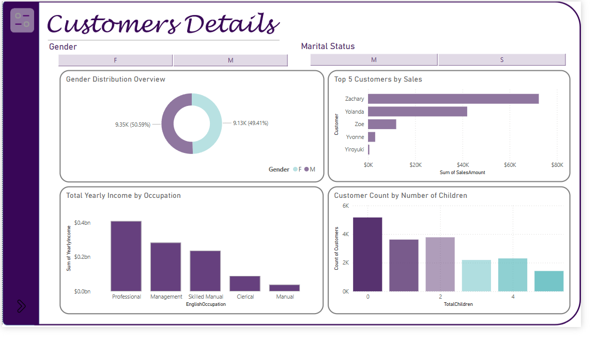

# AdventureWorks Power BI Dashboard Project

## Project Overview
This project focuses on building an interactive and insightful **Power BI dashboard** using Microsoft's **AdventureWorks Database**. The goal is to extract, transform, and visualize business data to uncover key insights that support informed decision-making.

---

## Objectives
- Extract real-time data from **Microsoft SQL Server** using **DirectQuery**.
- Apply **dimensional modeling** techniques to achieve a **snowflake schema** structure.
- Develop comprehensive **DAX measures** to streamline data analysis.
- Create multiple **visualizations** to represent various aspects of business performance.

---

## Tools & Technologies
- **Power BI**  
- **Microsoft SQL Server**  
- **DAX (Data Analysis Expressions)**  
- **DirectQuery Mode**

---

## Data Extraction
- Connected to the **AdventureWorks Database** via **Microsoft SQL Server**.
- Utilized **DirectQuery Mode** to ensure real-time data access and updates.

---

## Data Transformation
- Applied **dimensional modeling** to structure data efficiently.
- Designed a **snowflake schema** for enhanced normalization and data integrity.
- Cleaned and transformed datasets to ensure accuracy and consistency.

---

## Visualizations & Insights
- **Top 5 Countries by Sales Performance** 
  Highlighting the countries generating the highest revenue.
  
- **Total Orders by Product Category**  
  Showcasing product category performance in terms of order quantity.
  
- **Customer Distribution by Number of Children** 
  Analyzing customer demographics based on family size.

- **Sales Trends by Order Date, Ship Date, and Due Date**  
  Tracking sales lifecycle stages and delivery performance.

- **Top 5 Customers by Sales**  
  Identifying key customers contributing the most to revenue.

- **Total Yearly Income by Occupation** 
  Evaluating income trends across different professional roles.

---

---

